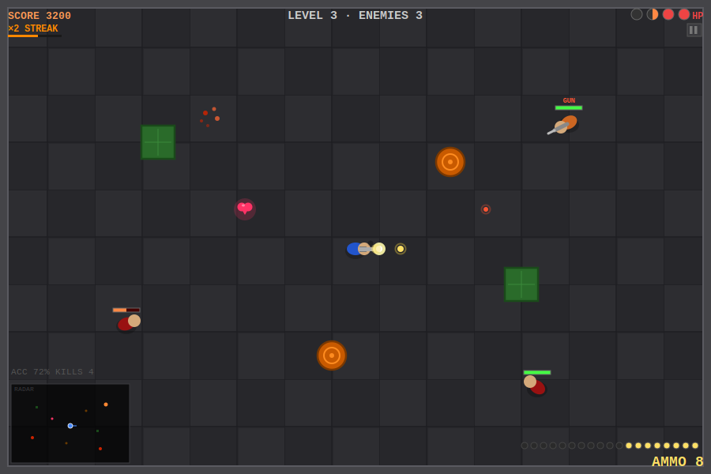
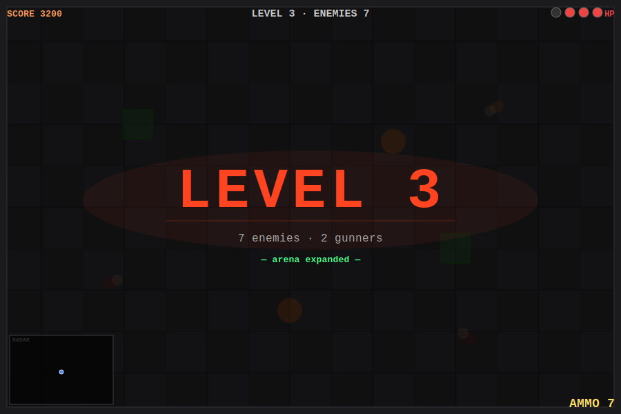
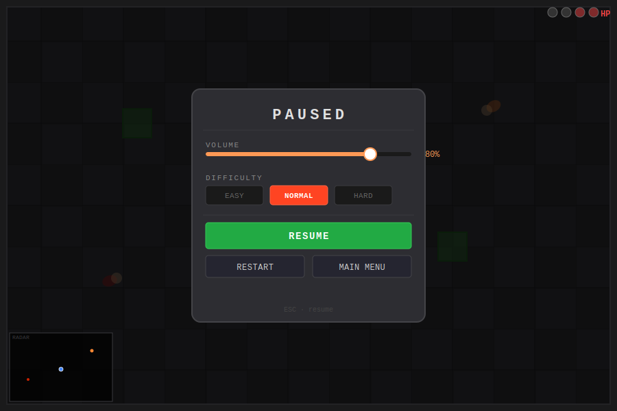

# ⚡ FLASHPOINT

**Top-down tactical shooter — pure HTML5 Canvas, zero dependencies.**

---

---

## Features

| | |
|:---|:---|
| 🎯 **Top-down combat** | WASD movement · free mouse-aim · click to shoot |
| 👾 **Two enemy types** | Knife-wielding rushers and long-range gunners |
| 🔥 **Kill streaks** | Chain kills within 2 s for ×2 / ×3 score multiplier |
| ❤️ **Dynamic HP** | Max HP grows every level · half-pip knife damage · heart pickups |
| 🗺️ **Growing arena** | Map expands at L3, L6, L9 to match the rising enemy count |
| 📈 **Difficulty scaling** | Gunner accuracy and fire rate increase each level — plus Easy/Normal/Hard |
| 📡 **Minimap radar** | Live RADAR panel auto-scales to the current arena size |
| 🔊 **Synthesised audio** | All sounds generated via Web Audio oscillators — zero audio files |
| ⚙️ **In-canvas pause menu** | Volume · difficulty · move speed + aim drag sensitivity sliders · restart · main menu |
| 💾 **Persistent records** | High score, best level, total kills, accuracy via `localStorage` |

---

## Game Views

<table>
<tr>
<td width="50%" align="center">

 <em>Level intro — the layout is revealed before combat starts</em>
</td>
<td width="50%" align="center">

 <em>Pause menu — fully canvas-drawn, opened with ESC or the HUD icon</em>
</td>
</tr>
</table>

---

## Controls

| Input | Action |
|:---|:---|
| `W A S D` | Move |
| `Mouse` | Aim |
| `Left Click` | Shoot |
| `ESC` | Pause / resume |
| `⏸ icon` (top-right corner) | Pause |

---

## Game Mechanics

<strong>Enemies</strong>

 

- **Rushers** charge directly at the player using combined steering (attraction toward player + quadratic repulsion from crates/barrels so they navigate around cover). Contact deals **½ HP** knife damage on an 850 ms cooldown.
- **Gunners** keep a preferred standoff distance (~215 px) and shoot from range. Bullets travel in straight lines and are blocked by crates and barrels, so cover matters.
- Enemy count per level: `1 + level × 2`. Gunner count: one additional per level starting from L2.

<strong>Health & pickups</strong>

 

- Starting max HP: **3 pips**
- Max HP gains **+1** on each level clear; current HP also gains +1 (capped at new max)
- Gunners have a ~42% chance to drop a **heart** on death — walk over it to restore 1 HP
- Knife damage is **½ HP**: the pip display renders half-filled circles using a canvas clip path

<strong>Kill-streak multiplier</strong>

 

| Streak | Score per kill |
|:---:|:---|
| 1 kill | `100 × level` |
| 2–3 kills | `200 × level` (×2) |
| 4+ kills | `300 × level` (×3) |

The streak timer resets **2 seconds** after the last kill. A decay bar under the streak label shows how much time remains.

<strong>Scoring</strong>

 

| Source | Points |
|:---|:---|
| Kill | `100 × level × streak_mult` |
| Time bonus | up to +700 (decays per second spent in the level) |
| Accuracy bonus | `(hits / shots) × 300` |

High score, best level, total kills, and career accuracy are saved to `localStorage`.

<strong>Difficulty & gunner scaling</strong>

 

Gunner fire rate and aim spread tighten as levels increase, then the Easy/Normal/Hard toggle applies a multiplier on top:

| Modifier | Fire interval | Aim spread |
|:---:|:---:|:---:|
| Easy | ×1.35 (slower) | ×1.6 (wider) |
| Normal | ×1.0 | ×1.0 |
| Hard | ×0.75 (faster) | ×0.55 (tighter) |

At L14+ on Hard, gunners reach minimum cooldown (0.9 s) with near-zero spread.

<strong>Arena growth</strong>

 

Every third level the canvas resizes — all spawn points, container positions, and the minimap scale update automatically.

| Levels | Arena size |
|:---:|:---:|
| 1–2 | 900 × 600 |
| 3–5 | 1 050 × 700 |
| 6–8 | 1 200 × 800 |
| 9+ | 1 350 × 900 |

---

## Tech

| Layer | Detail |
|:---|:---|
| **Rendering** | HTML5 Canvas 2D — single `<canvas>` element, no DOM overlays |
| **Game loop** | `requestAnimationFrame` with `dt` capped at 50 ms to avoid spiral-of-death |
| **State machine** | `START → INTRO → PLAYING ↔ PAUSED → DEAD / LEVEL_CLEAR` |
| **Collision** | AABB for crates · circle vs circle for barrels, bullets, and entities |
| **Enemy AI** | Attraction force toward player + quadratic repulsion from containers |
| **Audio** | Web Audio API oscillators and noise — synthesised at runtime, zero files |
| **Persistence** | `localStorage` keys `fp_hiScore`, `fp_bestLevel`, `fp_totalKills`, `fp_totalHits` |
| **Deployment** | Vercel static hosting via `vercel.json` |
| **Dependencies** | **None** |
